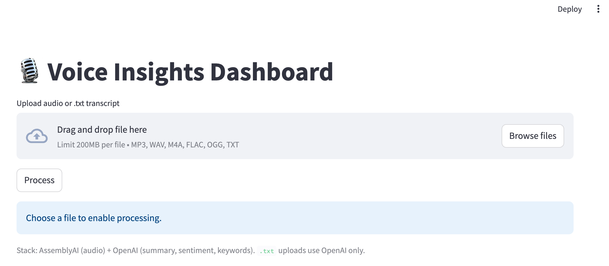
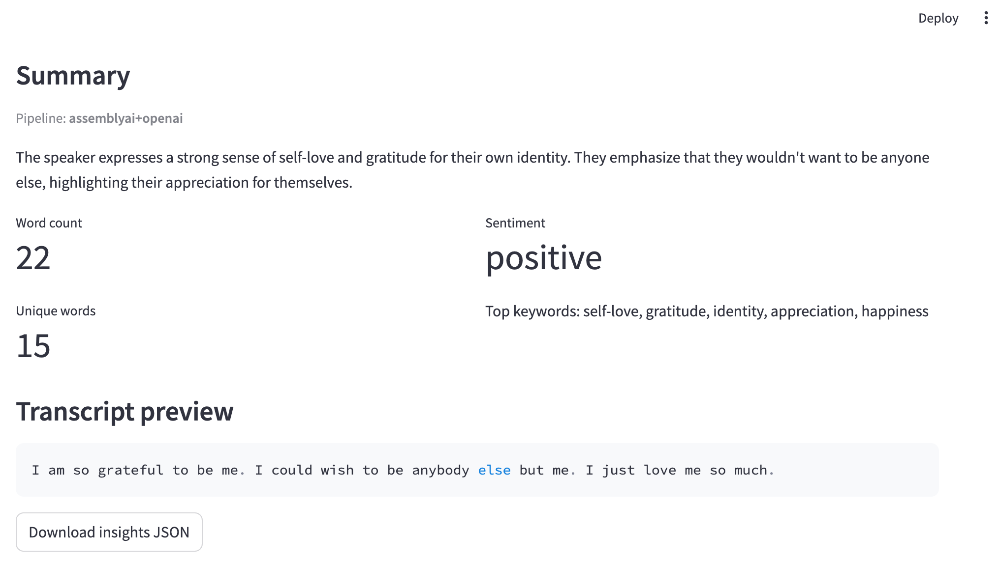

# Voice Insights Dashboard

End-to-end flow: upload **audio** or a **`.txt`** transcript → **AssemblyAI** transcribes audio → **OpenAI** produces summary, sentiment, and keywords. Word metrics are computed from the full transcript locally.





## Prerequisites

- Python 3.10+
- **[OpenAI API key](https://platform.openai.com/api-keys)** — required for every run (insights).
- **[AssemblyAI API key](https://www.assemblyai.com/dashboard/signup)** — required only when uploading **audio** (not needed for `.txt` only).

## Quickstart (local dev)

### 1) Environment and install

```bash
python -m venv .venv && source .venv/bin/activate   # Windows: .venv\Scripts\activate
pip install -r requirements.txt
cp .env.example .env
# Edit .env: set OPENAI_API_KEY and (for audio) ASSEMBLYAI_API_KEY
```

### 2) Run backend (terminal 1)

```bash
uvicorn backend.app:app --reload --port 8000
```

Check `http://127.0.0.1:8000/health` — `openai_configured` / `assemblyai_configured` show whether keys are loaded.

### 3) Run frontend (terminal 2)

```bash
streamlit run frontend/app.py
```

### 4) Use it

- Open Streamlit (usually http://localhost:8501).
- Upload **audio** (mp3, wav, m4a, flac, ogg) or a **`.txt`** transcript.
- Large files may take several minutes; keep both terminals open.

Artifacts per job: `data/jobs/<id>/input/`, `transcript.txt`, `output/insights.json` (under `data/jobs/` — gitignored).

## Environment variables

| Variable | Purpose |
|----------|---------|
| `OPENAI_API_KEY` | **Required.** Powers summary, sentiment, keywords. |
| `ASSEMBLYAI_API_KEY` | **Required for audio.** Ignored if you only use `.txt`. |
| `OPENAI_MODEL` | Optional. Default `gpt-4o-mini`. |
| `DATA_DIR` | Job storage root (default `data`). |
| `BACKEND_BASE_URL` | Streamlit → API URL (default `http://localhost:8000`). |
| `TRANSCRIPT_PREVIEW_CHARS` | Optional. Preview length in API/UI (default `2000`). |

## Project layout

```
.
├─ backend/           # FastAPI + pipeline (AssemblyAI + OpenAI)
├─ frontend/          # Streamlit UI
├─ docs/
│  ├─ operations.md
│  └─ images/
│     ├─ example1.png       # README: upload UI
│     └─ example2.png       # README: results
├─ data/              # .gitkeep; runtime jobs in data/jobs/
├─ .env.example
├─ requirements.txt
└─ README.md
```

VS Code / Cursor: [`.vscode/tasks.json`](.vscode/tasks.json).

## Roadmap (ideas)

- Speaker diarization via AssemblyAI config
- PostgreSQL + object storage
- Docker / docker-compose
- Auth / API key gate for the API

---

Portfolio MVP by Víctor Fernández.
